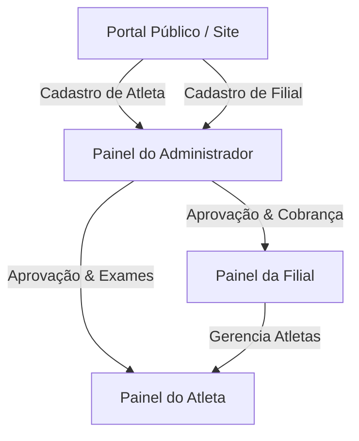

# Manual do Sistema — Federação de Karatê Goju-Ryu 🥋

Este manual detalha o funcionamento, as regras de negócio e os fluxos operacionais da plataforma **Goju-Ryu Karate Kai (GRKKK)**, um sistema completo de ERP e CMS integrado para a gestão de atletas, filiais (dojos), exames de faixa, eventos e controle financeiro.

---

## 1. Visão Geral do Ecossistema

O sistema é dividido em quatro grandes portais interdependentes. O diagrama abaixo ilustra o fluxo de dados e as relações entre os papéis:



---

## 2. Portais e Suas Funcionalidades

### A. Portal Público (Site Institucional)
Acessível a visitantes, alunos e público geral. Oferece as seguintes seções:
*   **Página Inicial (Home):** Banner institucional, apresentação do estilo Goju-Ryu e parceiros oficiais.
*   **História:** Raízes históricas do Karatê Goju-Ryu e a linhagem da IOGKF.
*   **Eventos:** Listagem pública de exames, cursos e competições com carregamento dinâmico de banners de imagem.
*   **Filiação:** Links de atalhos rápidos para o auto-cadastro de novos atletas ou solicitação de filiação de novas filiais.
*   **Contato:** Formulário de envio de mensagens integrado ao banco de dados e ao CMS.
*   **Validação de Certificados:** Sistema de consulta por código de autenticidade (radar visual) para confirmar a validade de diplomas de exames de faixa emitidos pela federação.

---

### B. Painel do Administrador (ERP / CMS)
O centro de controle operacional da federação. Suas principais atribuições são:

#### 1. Gerenciamento do Site (CMS)
*   **Notícias:** Criação, edição e exclusão de matérias e comunicados oficiais.
*   **Galeria:** Upload de fotos de treinos, Gasshukus e graduações estruturado por categorias.
*   **Equipe:** Cadastro de membros da diretoria e comissão técnica exibidos no site.
*   **Mensagens:** Central de mensagens de contato recebidas. O administrador pode **responder diretamente pelo CMS** digitando um e-mail de retorno (enviado via SMTP integrado com Nodemailer) ou clicando no atalho do mailto local.

#### 2. Filiações & Aprovacões
*   **Aprovações Pendentes:** Listagem de solicitações de atletas e filiais. A aprovação ou reprovação processa logs de auditoria e limpa a pendência da tela em tempo real.
*   **Atletas:** Listagem global de atletas com filtros rápidos de busca, modalidades, faixa e status. Permite a inativação ou exclusão (soft-delete).
*   **Filiais:** Controle de dojos ativos e gerenciamento das filiais autorizadas.

#### 3. Controle Financeiro
*   **Lançar Faturamento:** Geração de cobranças customizadas para atletas ou filiais (taxa de filiação, anuidade, taxas de exames ou mensalidades).
*   **Métricas Operacionais:**
    *   *Total Pago / Recebido:* Acumulado das faturas pagas.
    *   *Faturamento em Aberto:* Total pendente de liquidação.
    *   *Taxa de Inadimplência:* Porcentagem calculada dinamicamente com base nas faturas vencidas.

#### 4. Auditoria do Sistema (`/auditoria`)
*   Painel que registra de forma cronológica todas as mutações no banco de dados (inserções, atualizações e deleções de atletas, filiais, eventos e pagamentos), incluindo metadados do agente que realizou a ação.

---

### C. Painel do Atleta
Área privada para o focado na vida marcial do aluno:

```
+-----------------------------------------------------------------------+
|  CARTEIRINHA DIGITAL                                     [ ATIVO ]    |
|  GRKKK (Karatê Goju-Ryu)                                              |
|                                                                       |
|  [FOTO/INICIAIS]      Nome: Nome Completo do Atleta                   |
|                       Registro: GRKKK-A12B34C                         |
|                       CPF: 000.***.***-00                             |
|                       Graduação Principal: Faixa Verde (4º Kyu)       |
+-----------------------------------------------------------------------+
```

*   **Carteirinha Digital:** Documento oficial digitalizado exibindo o número de registro federativo único, CPF mascarado, filial vinculada e graduação (faixa) principal ativa.
*   **Exames de Faixa:**
    *   Permite a inscrição em editais de exames abertos pela federação.
    *   Oferece opção para o cancelamento de inscrições agendadas de forma automática.
*   **Eventos em Aberto:** Exibe competições, Gasshukus e cursos da federação com seus respectivos banners de imagem.
*   **Meus Dados (Atualizar Perfil):**
    *   Formulário estruturado nos blocos *Identidade*, *Contato & Localização* e *Modalidades/Graduações*.
    *   Validação em tempo real e de salvamento que impede o cadastro de CPFs inválidos.
    *   Sincronização automática: a alteração da graduação da primeira modalidade atualiza de forma síncrona a coluna `faixa` no banco de dados, liberando emissões de carteirinhas e sumindo alertas de cadastro incompleto.

---

### D. Painel da Filial (Dojo)
Permite ao Sensei gerenciar as atividades da sua academia/filial:
*   **Dados Cadastrais da Filial:** Edição de Nome Oficial, Nome Fantasia, tipo (vinculada, afiliada ou associada), CNPJ da filial (validado matematicamente), endereço e dados do Responsável Técnico (incluindo o CPF do responsável validado).
*   **Atletas da Filial:** Listagem e busca rápida de todos os alunos vinculados ao dojo, exibindo sua graduação atualizada e status de filiação.

---

## 3. Fluxo de Regras de Negócio e Validações

### A. Fluxo de Cadastro e Matrícula de Atleta
1.  O atleta solicita matrícula pelo formulário público em `/auth/cadastro-atleta` fornecendo dados básicos como Nome, Email e Telefone.
2.  O cadastro é enviado ao banco de dados com status `pendente` e um identificador provisório gerado automaticamente.
3.  O administrador acessa o painel de aprovações, revisa os dados e aprova o atleta.
4.  No primeiro login do atleta, ele é redirecionado para `/home/completar-cadastro` para preencher as informações obrigatórias adicionais (incluindo CPF válido, endereço residencial completo, filiação ao Dojo e professor responsável).
5.  Ao atualizar e salvar no painel "Meus Dados", a graduação da sua primeira modalidade marcial é salva e a coluna `faixa` é atualizada.

> [!IMPORTANT]
> O CPF de um atleta ou responsável técnico de filial deve ser único em toda a base de dados. O sistema bloqueia duplicidades.

### B. Regra de Negócio de Validações de CPF/CNPJ
*   **CPF:** Deve possuir 11 dígitos numéricos válidos baseados no cálculo dos dois dígitos verificadores (conforme padrão da Receita Federal).
*   **CNPJ:** Deve possuir 14 dígitos válidos calculados com base na matriz de pesos oficiais.
*   Ambos possuem máscaras automáticas no formulário que guiam a digitação:
    *   CPF: `000.000.000-00`
    *   CNPJ: `00.000.000/0000-00`

---

## 4. Guia Rápido de Solução de Problemas (FAQ)

> [!TIP]
> **O atleta atualizou a faixa nas configurações, mas o painel antigo continua mostrando a faixa antiga?**
> A sincronização agora é automática com a primeira modalidade. Certifique-se de que a modalidade desejada está na primeira linha (Modalidade 1) do formulário de graduações e clique em "Salvar".

> [!WARNING]
> **Ao tentar rodar `npm run build` localmente, ocorre erro de PageNotFoundError?**
> Esse erro ocorre quando você roda o build de produção com o servidor local de desenvolvimento (`npm run dev`) em execução no terminal. Pare o dev server (`Ctrl + C`), execute `npm run build` e em seguida reinicie o ambiente de desenvolvimento.
